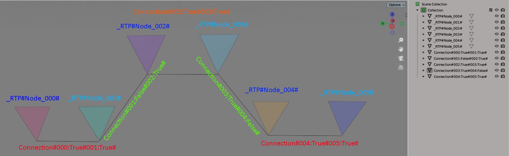

# RE4-RTP-TOOL
Extract and repack RE4 RTP files (RE4 ubisoft/2007/steam/uhd/Ps2)

**Translate from Portuguese Brazil**

Programas destinados a extrair e reempacotar arquivo .RTP do RE4 de PS2, 2007, UHD.
 Nota: esse é o arquivo que define quais rotas os inimigos vão seguir para chegar até o player. Então tem o "problema do caixeiro viajante".

**Update B.1.1.2**
 Nessa nova versão, para arquivos "0000.RTP", irá gerar arquivos .obj de nome "0000_RTP.obj", mudança feita para evitar sobreposição de arquivos.
 Agora, o programa, ao gerar o arquivo .obj, não terá mais os zeros não significativos dos números, mudança feita para gerar arquivos menores.

**Update B.1.1.0.1**

Adicionado compatibilidade com outros editores 3D que não suportam caracteres especiais #: como, por exemplo, o 3dsMax;
  Adicionado também uma verificação no nome dos grupos, então caso esteja errado o nome, o programa avisa-rá;
  Os arquivos da versão anterior são compatíveis com essa versão;

**Update B.1.1.0.0**

Atualizado o algoritmo de geração de caminho, agora as rotas geradas são boas o suficiente em comparação ao algoritmo original do jogo e em comparação com o algoritmo da tool do "Son of percia";
  Mudei para o ".Net Framework 4.8", para compatibilidade com o Windows 7;
  Os arquivos da versão anterior são compatíveis com a versão atual;

## RE4_RTP_EXTRACT.exe

Programa destinado a extrair o arquivo RTP, (escolha o .bat da mesma versão do seu jogo) sendo que irá gerar os arquivos:

* .OBJ, esse é o arquivo no qual vai ser editado, veja as informações abaixo.
* .IDXRTP, esse arquivo é necessário para o repack, mas seu conteúdo não importa.
* .TXT2, esse é um arquivo de debug, apenas informacional, por padrão não é gerado.

**OBJ FILE**
 A escala do arquivo é 100 vezes menor que a do jogo, sendo Y a altura.
 Veja o Exemplo:
 

  O nome dos objetos tem que ser exatamente como é descrito abaixo:
  Nota: o programa não diferencia minúsculas de maiúsculas.

* **_RTP#Node_000#** onde 000 é um número decimal que pode ir de 0 a 254, esses são os pontos onde os inimigos vai passar, a localização é definida pelo ponto de menor altura do triangulo.

* **Connection#000:True#001:True#** são linhas, a localização da linha não é importante para o repack, é apenas para referencia, o importante é o nome do objeto, no qual faz a ligação entre dois pontos: seguindo a definição abaixo:

*_Connection#000:True#001:True#_* vai ter uma conexão entre o node 0 e o node 1, sendo que pode ir do node 0 para 1 , e do node 1 para o 0
 *_Connection#001:False#002:True#_* cria uma conexão onde pode ir do node 2 para o 1, porem não pode fazer o caminho inverso.
 *_Connection#003:True#004:False#_* cria uma conexão onde pode ir do node 3 para o 4, porem não pode fazer o caminho inverso.

 ----> No Update B.1.1.0.1, o nome dos objetos/grupos também pode ser:
* **\_RTP\_Node\_000\_**
* **Connection\_000\_True\_001\_True\_**

 ----> Sobre verificações de grupos:
  * No Repack se ao lado direito do nome do grupo aparecer o texto "The group name is wrong;", significa que o nome do grupo está errado, e o seu arquivo RTP vai ficar errado;
  * E se ao lado direito aparecer "Warning: Group not used;" esse grupo esta sendo ignorado pelo meu programa, caso, na verdade, você gostaria de usá-lo, você deve arrumar o nome do grupo;

## RE4_RTP_REPACK.exe

Programa destinado a reempacotar o arquivo RTP, necessita de um arquivo .idxrtp com o mesmo nome do arquivo .obj.
  Nota: escolha o .bat da mesma versão do seu jogo.

## Problema do caixeiro viajante

O arquivo .RTP é pode ser dividido em 3 blocos, e o terceiro bloco é o qual define os caminho entre dois nodes, na atualização "B.1.1.0.0", corrigi o problema dos caminhos, não é necessariamente o caminho mais curto, mas é bom o suficiente para não se notar diferença com o algoritmo que foi usado no jogo;

## Código de terceiro:

[ObjLoader by chrisjansson](https://github.com/chrisjansson/ObjLoader):
Encontra-se no RE4_RTP_REPACK, código modificado, as modificações podem ser vistas aqui: [link](https://github.com/JADERLINK/ObjLoader).

**At.te: JADERLINK**
 Thanks to "mariokart64n" and "zatarita"
 2024-08-13